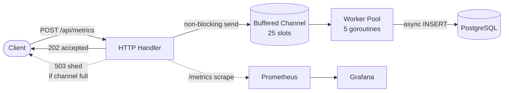
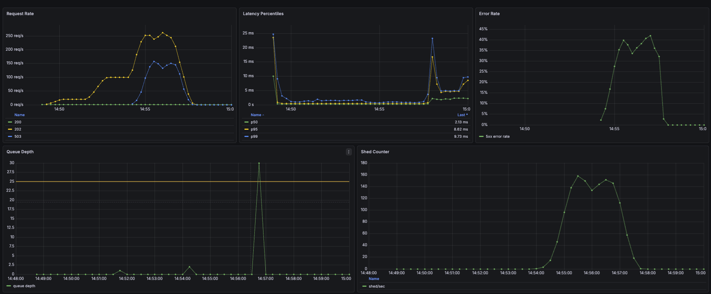
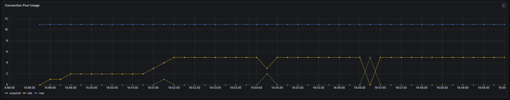
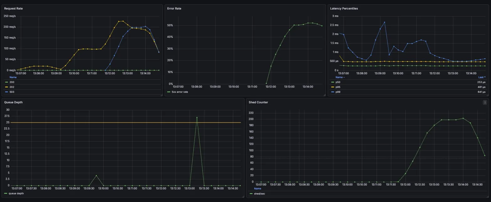
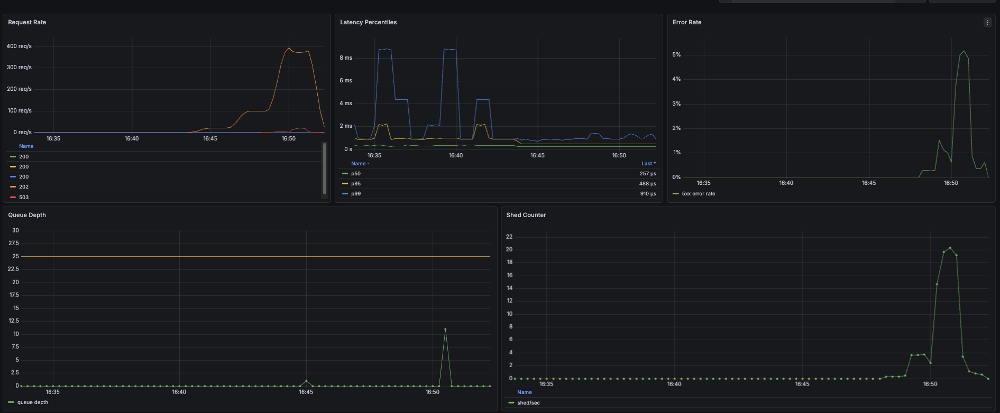
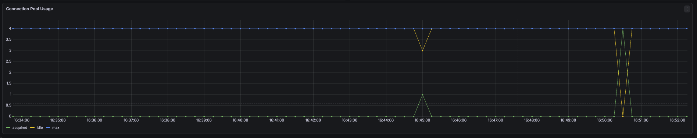

# MetricFlow

MetricFlow is a Go metrics ingestion service that demonstrates graceful degradation, with fully implemented backpressure visible via Grafana.

Production metrics pipelines have to handle overload somehow: either by slowing the whole system down, failing unpredictably, or shedding load intentionally. MetricFlow takes the third path, and makes the resulting tradeoff visible.

---

## Architecture



The service accepts JSON requests via the /api/metrics endpoint. The handler validates the JSON and hands it off to a buffered channel, where worker goroutines pull from it asynchronously and insert metrics into Postgres.

The central design choice is the asynchronous handoff from the handler, which doesn't touch the database directly. This keeps the handler fast - validation and channel send complete within microseconds - which means both the 202 success path and the 503 shed path respond quickly. Worker goroutines handle the slow work of database inserts independently, draining the channel as capacity allows.

Capacity is bounded by the 25-slot channel buffer combined with 5 worker goroutines. When offered load outpaces the workers' ability to drain the channel, new requests arriving at a full channel are shed with a 503. The next bottleneck downstream is the pgx connection pool, which uses defaults (max 4 or NumCPU, whichever is higher). Raising the worker count beyond that ceiling would shift the constraint from the channel to the pool itself.

---

## Quickstart

Bring up the full stack with Docker Compose:

```bash
git clone https://github.com/JamieMariniLoebe/metricflow
cd metricflow
cp .env.example .env
docker compose up -d
```

Services available once healthy:

- **MetricFlow API:** `http://localhost:8080`
- **Prometheus:** `http://localhost:9090`
- **Grafana:** `http://localhost:3000` (default login: `admin` / `admin`)

The MetricFlow dashboard auto-provisions on startup under Dashboards → MetricFlow.

Ingest a test metric:

```bash
curl -X POST http://localhost:8080/api/metrics \
  -H "Content-Type: application/json" \
  -d '{"metric_name":"cpu_usage","metric_type":"gauge","measured_at":"2026-04-22T15:00:00Z"}'
```

Run the included load test:

```bash
k6 run k6/load-test.js
```

Tear down:

```bash
docker compose down -v
```

---

## API

| Endpoint       | Method | Purpose                             | Responses                               |
| -------------- | ------ | ----------------------------------- | --------------------------------------- |
| `/api/metrics` | POST   | Ingest a metric                     | 202 accepted, 503 shed, 400/422 invalid |
| `/api/metrics` | GET    | Query metrics with optional filters | 200, 400 on bad params                  |
| `/metrics`     | GET    | Prometheus scrape endpoint          | 200                                     |
| `/health`      | GET    | Liveness probe                      | 200                                     |

**Example request body:**

```json
{
  "metric_name": "cpu_usage",
  "metric_type": "gauge",
  "labels": { "host": "web-01" },
  "val": 42.5,
  "measured_at": "2026-04-22T15:00:00Z"
}
```

**Query filters for GET:** `metric_name`, `metric_type`, `start_time`, `end_time` (RFC3339).

---

## Load Testing & Operational Findings

Load testing was run with k6 to verify the service's backpressure and graceful degradation behavior under sustained overload. The test ramps through three 2-minute plateaus - 10 VUs (baseline), 50 VUs (medium), and 200 VUs (overload) - with each VU firing one request every 500ms. Entire test was run against MetricFlow in Docker Compose on an M-series MacBook Pro, single-host, single-instance.




| Load Stage | Offered Load | Accepted (202) |         Shed Rate |    p50 |    p95 |     p99 |
| ---------- | -----------: | -------------: | ----------------: | -----: | -----: | ------: |
| Baseline   |       10 VUs |       20 req/s |                0% | 259 µs | 493 µs | 3.05 ms |
| Medium     |       50 VUs |     99.2 req/s |                0% | 259 µs | 492 µs | 1.47 ms |
| Overload   |      200 VUs |  252–262 req/s | ~40% peak / 26.6% | 255 µs | 484 µs |  940 µs |

The k6 run produced 77,276 total requests, of which 56,715 returned 202 and 20,561 returned 503. Server-side counters matched exactly: queued = 56,715, persisted = 56,715, shed = 20,561. Three-way parity across the full handler -> worker -> DB path validates not just the rejection path but the entire pipeline. Zero drain loss, zero drift between layers, and zero requests unaccounted for. The instrumentation can be trusted during real incidents.

The p50 and p95 numbers are the real headline finding: server-side latency held essentially constant across a 20x load increase, validating the core backpressure premise. The p99 column required careful reading, however. The 3.05 ms baseline reading reflects the canonical pool-warmup spike documented across virtually every connection-pooled service: pgxpool lazily creates connections on first acquire, and the small baseline sample (~3k requests) was dominated by those early outliers. By overload (~30,000 samples), the pool is fully warm and the p99 reflects true steady-state tail behavior at 940 µs. The capacity ceiling is enforced cleanly: rather than allowing queues to build, the system rejects what it can't handle, preserving low latency for accepted traffic. The alternative (unbounded queuing) produces the gradual slowdown, timeout cascades and unpredictable tail latency that backpressure exists to prevent.

The handler does very little synchronously - its main work is validating and handing off requests downstream. The heavy lifting of system performance lives downstream in the worker-to-Postgres path. In the same vein, queue depth as observed in Prometheus stayed at zero for almost the entire test, with a single transient spike to 30 captured during the overload phase. The channel fills transiently whenever shedding occurs (the mechanical precondition for a shed event), but workers drain it fast enough that the 5-second scrape samples rarely even catch a filled state. The visible spike is the exception that proves the rule.

Implementing load shedding in this design comes at the cost of accepted throughput: under sustained 200 VU overload, the system rejected ~40% of incoming requests at peak (peaking at ~150 shed/sec, range 133–158), settling around 26.6% across the full 8-minute test. The benefit is a system with more predictable latency, cleaner failure signals, and protection from cascading failures. In a domain such as metrics ingestion, where clients can have their own retry options, shedding is cheaper than the alternatives of chronic system failures and unpredictable latency.

**Note on latency measurement:** server-side numbers above are MetricFlow's internal histogram (`http_request_duration_seconds`). k6's client-side p95 was 11.69 ms, reflecting added network and Docker bridge overhead in this single-host setup. The 25× gap between the two is the local loopback round-trip, not service work.

---

## Day 2 Operations

**Test:** k6 load-test.js, 8 min, 10 → 50 → 200 VU ramp

### #1: Pod Kill Mid-Request



After a clean baseline, the pod was killed at the 2-minute mark. The Request Rate panel stops updating during the outage (Prometheus has no scrape target), so no new data points land. Restarting the port-forward restored client traffic to the new pod, and the request rate climbed back through 100 and into the 200 VU plateau. As the channel buffer saturated under sustained load, MetricFlow began returning 503s rather than queueing indefinitely; the Shed Counter ramps in lockstep, confirming the load-shedding design engaging as intended.

When the only MetricFlow pod was deleted, k6 logged hundreds of `connection refused` failures. The Error Rate panel showed nothing. This was expected, and it points at a real observability principle.

Prometheus uses a pull model: it scrapes the app's `/metrics` endpoint every few seconds and reads the counter values. The `http_requests_total` counter only increments when a request reaches the application middleware. During the outage, no requests reached the app — the TCP connection was refused at the kernel before any HTTP layer ran. Thus the counter never moved, so there was nothing for the panel to display.

This is the core blind spot of application-level metrics: they cannot see outages where the application itself is gone. Production observability covers this gap with external vantage points — black-box probes, load balancer metrics, synthetic monitoring — that measure availability from outside the service. MetricFlow's current dashboard is intentionally inside-out; a follow-up would add a blackbox_exporter probe to close the loop.

Compared k6's reported successful 202 count against Postgres row count for the test window:

- **k6 202 responses** (test window 18:07–18:15 UTC): 48,316
- **Postgres rows in same window:** 47,935
- **Delta:** 381 rows lost (~0.8%)

Graceful shutdown drained ~99.2% of in-flight requests cleanly under load. The 0.8% delta represents the edge case where requests were either mid-INSERT when worker timeout fired, or in the gap between handler-accept and channel-receive when SIGTERM arrived. The propagation gap has since been closed; re-verification is queued as a follow-up.

### #2: Memory Pressure Analysis




Three subsequent load-test runs at progressively tighter limits (50Mi+small payloads-->32Mi+small payloads-->32Mi+fat 2KB payloads). Each run ran ~77k requests, and three-way counter parity was maintained throughout all 3 runs. The initial expectation on these runs was for at least one OOMKilled, especially on the final fat-payload run with memory limit reduced to 32Mi.

However, OOM was never reached at any point during the 3 tests, disproving the expectation of at least one occurring. The service maintained a steady state at each ramp up, from baseline to overload.

The architecture itself prevents load-driven OOM, by design. In MetricFlow, the handler hands off payloads to the channel asynchronously, effectively capping per-request retention. The handler itself returns immediately, and the Go GC reclaims the struct. Worker pools are bounded, which caps concurrent processing to 5 items max. The channel itself is fixed length, and added backpressure shedding caps the queue depth to 25 items waiting to be processed. This design prevents load-driven OOM from ever occurring, as the application can hold at most 30 items at any moment, period. With ~2KB per fat payload x 30 in-flight items = ~60KB of retained payload data. Against a 32Mi memory limit, that's about <0.2% of headroom consumed.

Production-level Go OOMs are predominantly leak-driven, not necessarily load-driven. Both Datadog and Grafana document the dominant patterns: unbounded caches, leaked goroutines, defer-in-loops, etc. All of these produce gradual heap growth until the container limit triggers the OOMKiller. MetricFlow's bounded channel + fixed worker pool prevents the load-driven pattern; the leak-driven path is the residual risk which remains to be tested and accounted for in a future update. Detecting one in production would require watching `go_goroutines` climb over hours or even days, then using pprof to find the goroutines that aren't exiting. A soak test with leak injection is queued for an upcoming update.

## Observability

MetricFlow exposes the following metrics at `/metrics`:

- `http_requests_total` - counter, labeled by method, path, status
- `http_request_duration_seconds` - histogram, labeled by method, path, status
- `metricflow_ingest_queued_total` - counter of metrics accepted into the queue (handler side)
- `metricflow_ingest_queue_depth` - gauge of current channel occupancy
- `metricflow_ingest_shed_total` - counter of 503s returned due to full channel
- `metricflow_ingest_persisted_total` - counter of metrics successfully written to Postgres (worker side)
- `metricflow_pgxpool_acquired_connections` - gauge of currently in-use pool connections
- `metricflow_pgxpool_idle_connections` - gauge of currently idle pool connections
- `metricflow_pgxpool_max_connections` - gauge of configured pool ceiling
- `metricflow_pgxpool_acquire_wait_seconds_total` - counter of cumulative time spent waiting on an empty pool
- `metricflow_pgxpool_acquire_duration_seconds_total` - counter of cumulative time spent acquiring a connection

The provisioned Grafana dashboard shows six panels: request rate by status, latency percentiles (p50/p95/p99), 5xx error rate, queue depth with capacity threshold, shed rate, and connection pool usage (acquired/idle/max).
Together they tell the complete backpressure story --> offered load on the left, accepted vs shed in the middle, and internal queue state on the bottom.

---

## Design Decisions

### 1. HTTP Router: Chi

Chi was chosen over Gin and Echo because MetricFlow's routing needs are narrow. It only needs a handful of endpoints, no template rendering necessary, and no opinionated middleware stack. Chi's composability matches that scope cleanly, without any noise. Chi is also stdlib-adjacent: it wraps `net/http` without replacing it, which means every handler signature is the same (`http.Handler`), every middleware is composable with anything else in the Go HTTP ecosystem, and there is no framework-specific context leaking through the code. As one example, MetricFlow's Prometheus middleware uses Chi's `RouteContext().RoutePattern()` so that in the event path parameters are added, Prometheus labels and cardinality stay bounded.

It's true that Gin and Echo offer more features, such as built-in validation, binding helpers, etc. However, more features means more surface area to explain and more deviation from idiomatic Go. The goal of MetricFlow was to create a service that reads like Go, and not like a specific framework or ecosystem.

_Trade-off:_ All of that said, Chi's minimalistic nature means assembling things that Gin would just give for free. Within MetricFlow's scope, that's a feature, not a defect. But on a CRUD-heavy service with dozens of endpoints, that calculus flips.

---

### 2. DB Driver: pgx (over GORM)

`pgx/v5` was chosen over GORM because MetricFlow's SQL surface is small, stable, and performance-sensitive — exactly the kind of workload where GORM abstraction becomes more cost than benefit. GORM is built to reduce boilerplate for CRUD-heavy apps with numerous entities, complex relationships, and ad-hoc queries. MetricFlow, on the other hand, has one insert, one parameterized read with optional filters, and a single JSONB labels column. There's no boilerplate here worth abstracting away, so the GORM layer just adds overhead without actually simplifying anything.

`pgx` also gives direct, idiomatic support for PostgreSQL-specific types (such as JSONB, which the labels column relies on) and natively uses Postgres's binary protocol, which is faster than the text-based protocol older drivers such as `lib/pq` use. In contrast to GORM, `pgxpool` exposes pool internals directly as observable state, which closes the observability loop. In MetricFlow specifically, `InsertMetric` marshals the labels map directly to JSONB through a parameterized query, and `Store` holds a `pgxpool.Pool` so the pool state is observable from the driver layer on up. I also considered `database/sql` and `lib/pq`; ultimately `pgx` was chosen due to active maintenance, native binary protocol, and the richer Postgres-specific features.

_Trade-off:_ `pgx` does, however, require writing SQL by hand and handling pgx-specific types and result scanning. But for a service with a small, stable query surface like MetricFlow, this is a net positive. The SQL is visible, testable, and tunable.

---

### 3. Concurrency: Buffered Channel + Worker Pool

The ingestion pipeline uses a bounded buffered channel as the work queue with a fixed-size goroutine pool draining it. Buffer size is 25; worker count is 5. I chose this pattern because it makes backpressure explicit and measurable: the channel has a defined capacity, and a non-blocking send onto a full channel is the load-shedding signal.

The alternative — spawning a new goroutine for each request — is the easiest Go concurrency pattern, but it gives up all control over resource consumption. Unbounded goroutine counts under sustained load ultimately lead to memory growth, scheduler pressure, and exhausted database connections, with no clean way to shed load gracefully. I also considered a semaphore-style channel, but a persistent worker pool wins on a high-RPS service: workers are reused rather than spawned and reaped per task, and the goroutine count stays predictable. The channel-close handles the queue side cleanly; however, parent-context propagation to in-flight DB calls was a known gap in MetricFlow at the time of this test. 0.8% drain loss was measured during the pod-kill exercise. The propagation gap has since been closed, and re-verification on the new code path is queued as a follow-up exercise.

The key mental model shift for me from Java's thread pools was that the buffer size isn't primarily a performance tuning dial. It's a policy decision about how much work you are willing to hold before you start refusing requests. Channel depth is exposed as a Prometheus gauge (`metricflow_ingest_queue_depth`), which means the policy is directly observable, not just implicit.

_Trade-off:_ Three numbers are coupled together: buffer size, worker count, and DB pool size. Misalignment in any of those shifts the bottleneck to that layer, which is why measurement matters more than formulas.

---

### 4. Backpressure: 503 Load Shedding

When the ingestion channel is full, MetricFlow returns `503 Service Unavailable` immediately, rather than blocking the caller or queuing indefinitely. This is a deliberate fast-fail design choice: blocking the HTTP handler would tie up a connection and push back-pressure upstream to the caller's connection pool, which in turn cascades in ways that become harder to observe and control than an explicit rejection. A 503 response is the honest signal here, as the service itself is at capacity and not the specific client. It's the correct status code for a load balancer or rate-limiter to act on. Each shed increments the `metricflow_ingest_shed_total` counter, so the back-pressure regime is fully observable rather than a silent failure mode.

The k6 overload test validated the design choice. Across an 8-minute run, k6 reported 20,561 failures and the shed counter incremented to exactly 20,561 — and the queued counter (56,715) matched the worker-side persisted counter (56,715), confirming three-way parity across the entire pipeline. Failures were intentional rejections, not service errors, and accepted traffic landed in Postgres without loss. The deeper principle: under overload, fail-fast beats fail-slow. With ~40% of requests shed at peak (133–158 shed/sec sustained over
the 200 VU plateau), accepted traffic stayed at ~484 µs p95 throughout.

_Trade-off:_ A 503 shed-and-retry model requires callers to implement their own retry logic with backoff. A blocking model, however, absorbs short bursts more transparently but hides capacity problems until they become real outages.

---

### 5. Connection Pool Sizing (Measured No-Op)

`pgxpool` defaults to `max(4, runtime.NumCPU())` connections, which in this environment resolved to 11 max connections. The temptation under load testing is to crank it up, but the measurement told a different story.

At 200 VUs sustained over the full ramp, peak pool acquisition was 5 out of 11 connections, with zero wait time recorded across the entirety of the test window. The pool was never, at any point, the bottleneck. The constraint was upstream — in the worker-pool-to-Postgres pipe — and amping up the pool size would have done nothing except increase Postgres-side connection overhead. The default sizing was sufficient for the workload.

The Connection Pool Usage panel above tells the story directly: idle connections ramp from 0 to 5 during the baseline plateau as the pool warms, then hold steady at 5 through the medium and overload stages. Acquired connections stay at zero almost the entire test, with brief peaks to 5 during overload — the pool's 11-connection ceiling was never approached. The discipline matters more than the number: pool sizing was instrumented before any tuning was attempted, so leaving defaults in place was driven by the data rather than assumed.

_Trade-off:_ The finding is workload-specific. A heavier read pattern, larger result sets, or a multi-instance deployment could change the calculus. The sizing principle, however, stays the same: measure first, then tune from observed wait time, not from formulas.

---

### 6. Container Image: Scratch

The final container image is built `FROM scratch` — no base OS, no shell, no package manager. The Go binary is statically compiled (`CGO_ENABLED=0`) in a multi-stage build and copied directly into the scratch layer, along with the migrations directory. The final image size is 8.8 MB.

This was a deliberate security and operations choice. A scratch image has the smallest possible attack surface: no shell for an attacker to exec into, no system libraries to exploit, and no package manager for vulnerabilities to surface. Distroless was the other candidate: Google's minimal images include `ca-certificates`, `tzdata`, and a few base libraries, and Google rebuilds them regularly so vuln fixes flow in via tag pulls. The catch with using scratch is that there is nothing to patch: security posture rests entirely on the binary and the explicit files copied in, which means it's also the responsibility of CI scanning to catch issues there.

The operational tradeoff is real: there is no shell inside the container, so `kubectl exec` debugging requires either a sidecar or an ephemeral debug container. For MetricFlow specifically, that's an acceptable constraint, as Day 2 debugging mainly relies on Prometheus metrics, structured logs, and the pod-kill-tested graceful-shutdown path, not exec sessions. If the metrics and logs don't tell you what's wrong, the fix is to improve the instrumentation, not a shell.

_Trade-off:_ Scratch makes interactive debugging impossible from inside the container; the mitigation is instrumentation-first observability, as stated above. For a Java or Python service that needs dynamic libraries at runtime, distroless would be the better call, but for MetricFlow, scratch does the job.

---

### 7. Secrets Handling

In the original Minikube deployment, secrets were stored as Kubernetes Secrets and injected into the pod as environment variables. Here was the baseline pattern: Kubernetes Secrets are namespace-scoped, RBAC-controlled, and treated distinctly from ConfigMaps by audit tooling and secret-scanning systems (even though base64 is encoding, not encryption). The convention itself carries enough weight even when the cryptographic guarantees don't.

MetricFlow's current EKS deployment uses ESO to synchronize the RDS-managed secret from AWS Secrets Manager into the `metricflow-secret` k8s Secret via IRSA.

The known limitation in MetricFlow's setup is exactly that: base64 is decodable by anyone with namespace read access, and at-rest encryption in `etcd` is opt-in on most clusters and not configured on Minikube. The production evolution layers on three things: encryption at rest in `etcd`, tighter RBAC limiting which service accounts can read which secrets, and an external secret manager (AWS Secrets Manager or HashiCorp Vault) accessed via the External Secrets Operator, which keeps plaintext secrets out of the cluster entirely and centralizes rotation.

For MetricFlow in its current scope, the Kubernetes-native baseline is appropriate. MetricFlow documents this gap explicitly, so it's more a demonstrated awareness of the production roadmap than an oversight. In the upcoming EKS implementation, the upgrade path is ESO + AWS Secrets Manager.

_Trade-off:_ Kubernetes-native secrets are operationally simple but require additional layers to meet production security standards in a real multi-team production environment.

---

## Tech Stack

- **Go 1.25** - service implementation
- **Chi** - HTTP routing
- **pgx/v5** + **pgxpool** - Postgres driver and connection pooling
- **golang-migrate** - schema migrations
- **Prometheus client** - native instrumentation
- **slog** - structured logging
- **Docker** + **Docker Compose** - local stack orchestration
- **PostgreSQL 16** - metric storage
- **Prometheus 3.5** - metrics collection
- **Grafana 12.4** - dashboarding
- **k6** - load testing

---

## Known Limitations and Future Work

- **No automated test suite.** Zero \*\_test.go files. Unit tests for handler and ingester paths plus an integration test against a real Postgres instance are scheduled for Phase 3.
- **Single-replica deployment, no HPA.** Current manifests run one MetricFlow pod with no HorizontalPodAutoscaler or PodDisruptionBudget configured. Multi-replica + HPA pending Phase 2B / EKS migration.
- **Database schema is permissive.** `metric_name`, `metric_type`, and `measured_at` are nullable in Postgres; defense-in-depth NOT NULL constraints pending. No index on (`metric_name`, `measured_at`), so GET queries will degrade as the metrics table grows.
- **Validation is field-level only.** Required-field checks, body size cap, and unknown-field rejection are in place. Label cardinality limits, metric-name regex, and timestamp sanity checks deferred to Phase 3.
- **Request IDs not propagated through slog.** Structured logs lack request correlation. Adding middleware to inject request IDs into context and log attributes is a fix planned for future date.
- **No authentication or rate limiting.** Out of scope for this iteration; production deployment behind a gateway/sidecar is the assumed end state.
