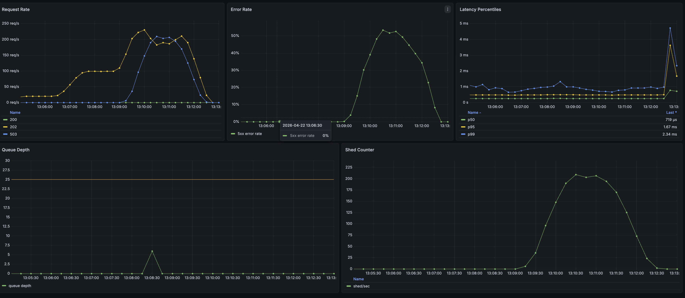

# MetricFlow

MetricFlow is a Go metrics ingestion service that demonstrates graceful degradation, with fully implemented backpressure visible via Grafana.

Production metrics pipelines have to handle overload somehow: either by slowing the whole system down, failing unpredictably, or shedding load intentionally. MetricFlow takes the third path, and makes the resulting tradeoff visible.

---

## Architecture


The service accepts JSON requests via the /api/metrics endpoint. The handler validates the JSON and hands it off to a buffered channel, where worker goroutines pull from it asynchronously and insert metrics into Postgres.

The central design choice is the asynchronous handoff from the handler, which doesn't touch the database directly. This keeps the handler fast - validation and channel send complete within microseconds - which means both the 202 success path and the 503 shed path respond quickly. Worker goroutines handle the slow work of database inserts independently, draining the channel as capacity allows.

Capacity is bounded by the 25-slot channel buffer combined with 5 worker goroutines. When offered load outpaces the workers' ability to drain the channel, new requests arriving at a full channel are shed with a 503. The next bottleneck downstream is the pgx connection pool, which uses defaults (max 4 or NumCPU, whichever is higher). Raising the worker count beyond that ceiling would shift the constraint from the channel to the pool itself.

---

## Quickstart

Bring up the full stack with Docker Compose:

```bash
git clone https://github.com/JamieMariniLoebe/metricflow
cd metricflow
cp .env.example .env
docker compose up -d
```

Services available once healthy:

- **MetricFlow API:** `http://localhost:8080`
- **Prometheus:** `http://localhost:9090`
- **Grafana:** `http://localhost:3000` (default login: `admin` / `admin`)

The MetricFlow dashboard auto-provisions on startup under Dashboards → MetricFlow.

Ingest a test metric:

```bash
curl -X POST http://localhost:8080/api/metrics \
  -H "Content-Type: application/json" \
  -d '{"metric_name":"cpu_usage","metric_type":"gauge","measured_at":"2026-04-22T15:00:00Z"}'
```

Run the included load test:

```bash
k6 run k6/load-test.js
```

Tear down:

```bash
docker compose down -v
```

---

## API

| Endpoint       | Method | Purpose                             | Responses                               |
| -------------- | ------ | ----------------------------------- | --------------------------------------- |
| `/api/metrics` | POST   | Ingest a metric                     | 202 accepted, 503 shed, 400/422 invalid |
| `/api/metrics` | GET    | Query metrics with optional filters | 200, 400 on bad params                  |
| `/metrics`     | GET    | Prometheus scrape endpoint          | 200                                     |
| `/health`      | GET    | Liveness probe                      | 200                                     |

**Example request body:**

```json
{
  "metric_name": "cpu_usage",
  "metric_type": "gauge",
  "labels": { "host": "web-01" },
  "val": 42.5,
  "measured_at": "2026-04-22T15:00:00Z"
}
```

**Query filters for GET:** `metric_name`, `metric_type`, `start_time`, `end_time` (RFC3339).

---

## Load Testing & Operational Findings

Load testing was run with k6 to verify the service's backpressure and graceful degradation behavior under sustained overload. The test ramps through three 2-minute plateaus - 10 VUs (baseline), 50 VUs (medium), and 200 VUs (overload) - with each VU firing one request every 500ms. Entire test was run against MetricFlow in Docker Compose on an M-series MacBook Pro, single-host, single-instance.



| Load Stage | Offered Load | Accepted (202) | Shed Rate |     p50 |     p95 |     p99 |
| ---------- | -----------: | -------------: | --------: | ------: | ------: | ------: |
| Baseline   |       10 VUs |      ~20 req/s |        0% | 0.25 ms | 0.48 ms | 0.71 ms |
| Medium     |       50 VUs |     ~100 req/s |        0% | 0.26 ms | 0.48 ms | 0.93 ms |
| Overload   |      200 VUs |     ~200 req/s |       52% | 0.78 ms | 3.62 ms | 4.72 ms |

The shed counter incremented in exact parity with k6's failed request count, as every 503 returned to the client corresponded to a counter increment on the server. This correlation confirms
the failures were intentional shedding rather than timeouts, connection errors, or resource exhaustion. More importantly, it validates the instrumentation itself: The metric doesn't undercount or overcount, so operational dashboards can be trusted during real incidents.

Through the baseline and medium load stages, request latency stays essentially flat with p95 sitting at 0.48 ms in both stages, despite a fivefold increase in offered load. Only at the overload stage does latency climb, and even then it only rises modestly to a p95 of 3.62 ms under active shedding. This is the point at which the capacity ceiling is clearly evident: rather than attempting to process every request that comes in and letting queues build, the system rejects what it realistically can't handle, and preserves low latency for accepted traffic. The alternative, unbounded queuing, would produce the gradual slowdown, timeout cascades and unpredictable tail latency that backpressure exists to prevent.

The handler does very little synchronously - its main work is validating and handing off requests downstream. The heavy lifting of system performance lives downstream in the worker-to-Postgres path. In the same vein, queue depth as observed in Prometheus stayed near zero throughout the test. The channel does fill transiently whenever shedding occurs (that's the mechanical precondition for a shed event), but workers drain it fast enough that the 5-second scrape samples rarely caught a filled state.

Implementing load shedding in this design comes at the cost of accepted throughput: under heavy load, the system rejected ~52% of requests. The tradeoff is this system has more predictable latency, cleaner failure signals, and protection from cascading failures. In a domain such as metrics ingestion, where clients have their own retry options, shedding is cheaper than the alternatives of chronic system failures and unpredictable latency.

---

## Observability

MetricFlow exposes the following metrics at `/metrics`:

- `http_requests_total` - counter, labeled by method, path, status
- `http_request_duration_seconds` - histogram, labeled by method, path, status
- `metrics_ingested_total` - counter of successfully queued metrics
- `ingest_queue_depth` - gauge of current channel occupancy
- `ingest_requests_shed_total` - counter of 503s returned due to full channel

The provisioned Grafana dashboard shows five panels: request rate by status, latency percentiles (p50/p95/p99), 5xx error rate, queue depth with capacity threshold, and shed rate. Together they tell the complete backpressure story --> offered load on the left, accepted vs shed in the middle, and internal queue state on the bottom.

---

## Tech Stack

- **Go 1.25** - service implementation
- **Chi** - HTTP routing
- **pgx/v5** + **pgxpool** - Postgres driver and connection pooling
- **golang-migrate** - schema migrations
- **Prometheus client** - native instrumentation
- **slog** - structured logging
- **Docker** + **Docker Compose** - local stack orchestration
- **PostgreSQL 16** - metric storage
- **Prometheus 3.5** - metrics collection
- **Grafana 12.4** - dashboarding
- **k6** - load testing

---

## Known Limitations and Future Work

- **Connection pool stats not exposed as metrics.** Pool acquisition time, idle/acquired connection counts not yet instrumented. Planned for later implementation along with other fixes.
- **Request IDs not propagated through slog.** Structured logs lack request correlation. Adding middleware to inject request IDs into context and log attributes is a fix planned for future date.
- **Single-instance deployment only.** K8s manifests and horizontal scaling planned for Phase 2B (Minikube → EKS).
- **No authentication or rate limiting.** Personal project scope - production deployment would require both (This project aims for close to production-level with given constraints)
- **Validation is minimal.** Required-field checks only. Label cardinality limits, metric name regex validation, and timestamp sanity checks deferred to later date.
- **pgx pool uses defaults.** `MaxConns` defaults to `max(4, NumCPU())`. Tuning based on observed bottleneck pending instrumentation above.
